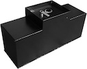
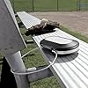

# 5X-Crypto-Security-Guide

Inspired by the [10x Bitcoin Security Guide](https://btcguide.github.io), this is the advice I find myself giving over and over in a semi-prescriptive guide. You don't need to follow it exactly, and very few people will.

It is written for tech-literate crypto holders who have mostly normal lives, a family, relatives, etc. Someone who got involved in a TGE, or got lucky on Kraken a few times, and isn't ready to cash out yet.

We're only trying to cover your "treasury". The funds you don't trade, and access every other month or so.

I am not rich enough to need this. This is how I wish my wealthy friends would get themselves organised. If people like it, I'll expand it and offer properly worked out variations. Maybe vibe code an interactive wizard 😊

## Assumptions

- That you don't want, or cannot have, others operating wallets for you. (If you can, also look at [how Vitalik manages his Ether](https://x.com/VitalikButerin/status/1785562273433387320).)
- Not overly worried about the State seizing assets.
- You'd like to preclude casual wrench attacks. But are not concerned by coordinated attacks involving multiple locations.
- Access to assets within 24 hours while not travelling.
- You do care about what happens if you are dead or incapacitated.
- $150k to 5m in assets to protect

## Required Knowledge

To start this guide you should know:

* How to use a hardware wallet
* What a seedphrase is
* That one wallet can have an infinite number of addresses
* That everything you do on-chain is visible
* Using DApps with Metamask or similar
* Some familiarity with [Safe Vault](https://safe.global/), but you can just read their docs before you start this guide.

## First Things First

* Pay taxes suitable to your home, standard of living, etc. In most countries, they **will** eventually get around to you.
* Secure your phone and laptop. Do the Apple and Facebook privacy checks. All that good stuff you've been putting off.
* Have a will. It's inevitable 😞
* Put in place a Power of Attorney so that someone you trust can look after your affairs if you are incapable.

## How you will access your funds

When a 5X Security Implementer decides to access their funds, their day might look roughly like this:

Get up, shower, get dressed, have breakfast. Take out their phone and grab a hardware wallet, setup a transaction on a multisig wallet. Read the newspaper.

Go to the living room. Retrieve a second hardware wallet and a dedicated tablet from a desk safe, scrutinise and sign the earlier transaction.

Cycle to their co-working office. Pull a second little tablet from their locker. Get the last hardware wallet. Give it one last look, and finally execute it.

Not something to do every day or for small amounts. But a perfectly acceptable ritual every other month.

Sound acceptable? Read on!

## Hygiene and Holdings 

Take a passphrase-protected spreadsheet or similar, and then record all your crypto assets.

These should be divided into Holdings. Each **Holding** will be funds you are happy to have publicly linked and want to manage together. Most people will only have one **Holding**.

In doing this you should consider:
- KYC status. Who knows it's yours?
- Tax
- Visibility
- Taint from a hack / impropriety

## Passphrases

A passphrase is an optional, advanced security feature that allows you to create a new wallet by adding an additional word to a 12–24 seed phrase.

With passphrases you can have one single seed with multiple different wallets. Each wallet would be designated by a different passphrase.

We use one passphrase to hide each wallet. This prevents **Guardians** or people protecting your **Stash** (explained later), who hold your backup plates from accessing your wallets independently.

We will use two different passphrases:
- **Personal**, this will be lost with you if you die or are lying in a coma.
- **Static**, which will go to whoever needs to deal with your assets if you are dead or lying in a coma.

Don't confuse passphrases with the PIN to unlock your hardware wallet. PINs just control their own individual bit of hardware. 

## Overview

In the 5X model, we separate your keys into 5 locations, locked with 2 passphrases.

We will keep your assets in multi-signature Safe Vaults, and each of these Vaults will require 3 of your 5 wallets to move any assets.

It is possible for someone else to get access to 3 out of 5 wallets, if they can gain access to your **Stash**, a **Guardian**, and they know your **Static** passphrase. This is what will happen if you pass away or get too sick to manage yourself.

## Locations

These are places to put your wallets. Some of them are physical locations, some are people, and some are services. Think of them as facilities rather specific buildings/roles.

### Personal 💼

The things you carry around with you day to day. Your purse, or briefcase.

### Stash 🏦

This is a location outside of your normal life that someone else can access with your consent. A rented box in a professionally secured vault would be ideal. These are available from many providers, your bank probably does this.

In most jurisdictions, the existence of this box will be disclosed to the authorities. However, the upside is that you can make *formal binding* arrangements for access in the event of your death or incapacity. Even if your lawyer conspires with your friends to access your safety deposit box with a false will and death certificate, it is unlikely they will sign themselves in and out of building with witnesses to do this.

You won't need to visit the **Stash** very often, so why not place it at a safe distance from your home? Worried about over-aggressive authorities. Why not in another country?

You could dig a deep hole in the local forest that's described to your heirs. Do what works for you, but don't complain if a treasure hunter digs it up in a few years 😊

### Home 🏡
Just where you wake up every day. Try to keep its location off the internet. You'll be keeping a **Home Safe** there and a **Desk Safe**.

### Office 📤

Somewhere you can work which is available during normal hours and has some independent security. Mostly it should have CCTV and be 20 minutes plus from your **Home**. It will need a **Desk Safe**. A coworking space, or your small business if you have one, or even, a gym club.

### Guardian A/B 🫂

Have two trustworthy independent friends. They will each hold one of your steel backup plates.

They should know the circumstances under which they should hand them over, e.g., to you in person, not distressed nor intoxicated, or to your heirs if you are dead, or your trustee if you are incapable. They do not need to be technical at all.

They should **not know** your **Static** passphrase nor who the other one is. Choose people from different spheres of your life, perhaps even living in different countries. They should not be your lawyer or a person who might hold your Power of Attorney.

### Legal 👩‍⚖️

Someone who will hold Will and your Letter of Wishes/Instruction, ensuring they are passed to the correct people in the event of your death or an accident that incapacitates you. (Note that Wills and Power of Attorney are usually public documents, and so a poor place to pass along secrets.)

You don't need to engage a blue-ribbon law firm. The consumer charity Which? runs [an online service](https://whichwills.which.co.uk) in the UK. Have a look around for what's available to you.

Include the following in your Letter of Wishes:
* **Static** passphrase
* Identity of your two **Guardians**
* The location and process for opening your **Stash**. Remember your heirs or attorney are not you — and any people at the **Stash**, e.g. the safety deposit company, will not know what to do with them unless you tell them.

## Safes

The main aim is to stop anything going missing without that being noticed, so there's no need to go overboard. With that said, you likely have watches, jewellery, etc, to protect too.

### Home Safe

A safe place in (or very near) your home. Ideally a properly installed safe if you have time and money to install one. A hidden floor safe encased in concrete is a great investment if you have a lot of valuables to protect. But there's a huge variety of affordable options, including wall safes, lock boxes, even fake wall sockets, plants, and books.

Here are some recommended home safe options available on Amazon:

| Image | Name | Features | Price |
|-------|------|----------|-------|
|  | [Stealth B5000 In-Ground Floor Safe](https://www.amazon.com/Stealth-Floor-Ground-Security-Mechanical/dp/B094T9RNP8) | Fully encased in concrete on five sides for maximum protection; hidden from plain view; mechanical lock for reliability. | $799.99 |
|  | [GHJGAGE 43.5" Tall Fireproof Wall Safe](https://www.amazon.com/GHJGAGE-Fireproof-Wall-Safe-Removable/dp/B0BXW3HWXJ) | Fits between standard 16" studs; fireproof construction; digital keypad with removable shelf. | $259.99 |
|  | [Elder Welder Hidden Wall Safe with Air Vent Cover](https://www.amazon.com/Elder-Hidden-Wall-Safe-Cover/dp/B0CGVRWHY6) | Disguised as an air vent; easy to install; combination lock; fits between 16" studs. | $149.99 |
|  | [Marcree 3.0 Cubic Feet Home Safe](https://www.amazon.com/Marcree-Compartment-Removable-Adjustable-Accessories/dp/B0CC8G4GN7) | Spacious 3.0 cubic feet capacity; fireproof and waterproof; removable shelves and interior compartments for organized storage. | $399.99 |
|  | [TAHOE TRAILS Book Safe with Key Lock](https://www.amazon.com/TAHOE-TRAILS-Tahoe-trails-safe/dp/B09BCGS4MF) | Disguised as a book; compact steel safe; key lock; ideal for storing money, passports, jewelry, and more. | $13.99 |

Or, you could seal everything in a mason jar to bury on your land 😊

### Desk Safes

Easily accessible secure storage near a workspace, such as a lock box or desk drawer safe. It should be tamper-evident and fixed in place. A laptop safe or office locker would work well.

Ideally a place you can fix a hardware wallet to with a chain. If you can't chain an item in place, you can always AirTag the items and put them in a drawer. Gun safes could be great if they are available where you are.

Here are some recommended desk safe options available on Amazon:

| Image | Name | Features | Price |
|-------|------|----------|-------|
|  | [Heavy Duty Steel Under Desk Handgun Safe](https://www.amazon.com/Heavy-Duty-Steel-Under-Desk/dp/B09ZDVWRBN) | Slide-away design with electronic keypad; can be mounted under a desk. | $139.99 |
|  | [Amazon Basics Steel Security Safe and Lock Box](https://www.amazon.com/Amazon-Basics-Security-Electronic-Keypad/dp/B00UG9HB1Q) | Electronic keypad with backup key; 0.5 cubic feet capacity; suitable for securing cash, jewelry, and ID documents. | $49.99 |
|  | [Master Lock 5900D Portable Personal Safe](https://www.amazon.com/Master-Lock-Portable-Personal-5900D/dp/B005K6JQXQ) | Portable safe with combination lock; includes cable to secure to fixed objects; ideal for securing small valuables. | $27.99 |
|  | [Amazon Basics Small Slim Desk Drawer Security Safe](https://www.amazon.com/Amazon-Basics-Security-Programmable-Electronic/dp/B078WPCQWK) | Slim design fits conveniently inside a drawer; programmable electronic keypad; emergency backup key included. | $48.24 |

## Shopping List

### Hardware Wallets

- [Trezor Safe 5](https://trezor.io/trezor-safe-5-black-graphite)
- [Ledger Shift](https://shop.ledger.com/products/ledger-flex/graphite)
- [Keystone Pro](https://shop.keyst.one/products/keystone-3-pro)
- 6 × **Steel Plates** (pick [something from here](https://jlopp.github.io/metal-bitcoin-storage-reviews/?ref=blog.lopp.net), but they're all Steel Plates 🙂)

### Signing Computers

- 1 × Android Tablet
- 1 × Small iOS device
- 1 × **Spare Phone** (Cheap emergency backup device for wallet recovery and transactions.)

We will use your phone as the signing device for the **Personal** wallet to avoid an additional device.

### Other Stuff
| Name | Purpose | Cost |
|------|---------|------|
| AirTag(s) | Track the **Personal** hardware wallet in case of loss. Maybe **Home** and **Office** if you are worried about them. | $29–35 |
| Keyring hoops | Attach hardware wallets to chains and other security measures. Just get a variety bag. | $5–10 |
| Long chains | Physically secure hardware wallets to desks or safes to prevent theft or accidental/lazy removal. | $15–30 |
| Keyring toy | It will make your hardware key much much harder to loose. | $5–15 |
| Super Glue / Epoxy | Bind chains, toys and AirTags to hardware wallets and cases. | $10–20 |
| Single six-sided casino dice | Generate truly random numbers for wallets. Casino dice ensure better randomness. | $5–15 |
| Tamper evident bags | See if anyone might have looked at a **Steel Plate**. | $20–40 for pack |
| Sticky Labels | Clearly mark all items to avoid confusions. | $5–10 |

## Setup Guide

Every time you use something for the first time, **label it clearly**.

1. Pick your two passphrases
2. Include your **Static** passphrase in a Letter of Wishes alongside your Will.
3. Include your **Static** passphrase in a Letter of Instruction for your Power of Attorney.
4. Mark the iOS device as **Home**, and the Android Tablet as Office. Use them *only with their associated location's hardware* wallet from now on.
5. Set up Keystone wallet using **Personal** passphrase.
6. Epoxy a keychain with the small toy and AirTag to the Keystone.
7. Use the Keystone Dice Mode and **Static** passphrase to set up one more wallet, called **Guardian** A. (Keystone allows for up to 3 independent wallets.)
8. Use [Keystone Dice Mode](https://guide.keyst.one/docs/dice-roll) and the **Static** passphrase to make a wallet called **Guardian** B and restore that as your third Keystone Wallet.
9. Set up Trezor as your **Office** wallet.
10. Set up Ledger as your **Home** wallet.
11. Install [Rabby Wallet](https://rabby.io) on your Android Wallet
12. Install on your iOS:
	1. [Metamask Mobile](https://metamask.io/en-GB/download)
	2. [Safe Wallet Mobile](https://help.safe.global/en/articles/40805-connect-external-signer-key) app
13. For each **Holding**:
	1. Take the next available Ethereum address from each wallet.
	2. Fund them with suitable coins, usually ETH.
	3. Use one of them to create a 5/5 [Safe Vault multisig](https://safe.global/).
	4. Record the address of the multisig, and add it to all the address books in your other devices.
	5. Set it to a 3/5 multisig.
	6. Do whatever extra testing you need to feel confident.
14. **Wipe the Guardian wallets from your Keystone.**
15. You can now bag each of your backup plates in a tamper-proof bag. They'll have serial numbers on the seals, write them down somewhere.
16. Put the backup plate for your **Personal** in your **Home Safe.**
17. Attach your **Home** wallet, e.g., the Ledger, to a desk using the chain, preferably out of sight in a **Desk Safe** of some sort.
18. Take your **Office** wallet, and the Android Tablet to your **Office** location and do similarly there.
19. Gather up the **Office** and Home **backup** plates and take them to your Safety **Deposit Box**. Make sure they have your contingency plans for death or incapacity on file.
20. Deliver each of the **Guardian** backup plates to their respective **Guardians**.
21. Collect the spare materials including the spare phone and put them somewhere safe.

## Failure and Recovery

### Single Wallet Loss

If you lose a device, it's best to replace it if you don't know where it is. It's extremely expensive to extract the data from most hardware wallets, but also hardware wallets are fairly cheap.

1. Order a new hardware wallet of the same type.
2. Retrieve the appropriate back-up plate, and clearly label it as "Void".
3. Install Metamask Mobile (or suitable crypto wallet app) on the **Spare Phone**.
4. Use the phone as a replacement for the lost wallet.
5. When the new wallet arrives, set it up as a new wallet, using your spare steel plate for the backup.
6. Replace your old wallet (now on your phone), with the new wallet (on your new hardware wallet) on each of your **Holdings** multisigs.
7. Send spare assets from the old wallet on your phone into the multisig.
8. Put the *new backup plate* in the location of the old one.
9. Put the old backup plate in a drawer somewhere. It doesn't really matter any more.
10. Wipe the **Spare Phone** and store it away.

### Loss of all hardware wallets

This is if your **Home** and **Office** locations, plus your **Personal** hardware wallet are unavailable. This is also the scenario that your agent (either your heirs or your attorney) will face.

Try to be a bit careful about bringing all your signing wallets together in the same place.

1. Buy new hardware wallets.
2. If you are able, retrieve your backup steel plate from your **Home Safe**. If not, contact one of your **Guardians**.
3. Retrieve the steel plates from your **Stash**.
4. If you took the steel plate from your **Home Safe**, you can simply restore everything back to normal.
5. If you used a **Guardian**'s backup steel plate, you should restore *that* wallet to the spare phone, and then treat your **Personal** as a **Single Wallet Loss**.
6. If the lost hardware wallets are "secure", e.g., we just don't have the PIN, then you can stop here.
7. If the fate of the hardware wallets is unknown, e.g., someone could eventually break into them, they should each be treated as a **Single Wallet Loss**. Sorry 😢
8. Put all the *current* backup steel plates and hardware wallets back where they should be.

### Loss of Stack location

1. Get a new **Stash** (or at least a new mason jar in your garden for the time being)
2. Treat **Home** as a **Single Wallet Loss**
3. Treat **Office** as a **Single Wallet Loss**

## Variants

### Bitcoin only

Trezor and Keystone have Bitcoin-only firmware. You might also want to consider the Bitcoin-only [ColdCard wallet](https://coldcard.com). You might find [creating a multisig more challenging](https://medium.com/@1700constantino/protect-your-bitcoin-with-an-electrum-multi-sig-wallet-with-coldcard-ledger-and-trezor-96397e4ce287), but [Electrum wallet](https://electrum.org) software and a few others have offered this for a while. You should definitely read [10x Bitcoin Security Guide](https://btcguide.github.io).

There is also [Casa](https://casa.io), which I'd recommend for less technical Bitcoin users.

### I have no heirs. My death will be deflationary.

Ignore the bits about Wills and just bury your "Safety Deposit Box".

But have a think about the Power of Attorney. We all have accidents and get sick.

If you really want to be the only person with access to your assets, you only need one passphrase for everything.

### Small organisation

* **Personal** becomes CEO.
* **Home** becomes CFO.
* **Office** becomes COO.

### HODL Forever

You can simply wipe all the hardware wallets after set-up. Although in this case it might be better to use a [Shamir Secret Sharing scheme](https://cryptotag.io/blog/shamirs-secret-sharing-backup/), which creates multiple key fragments that can later be recombined, as you are only planning to access the assets once.
